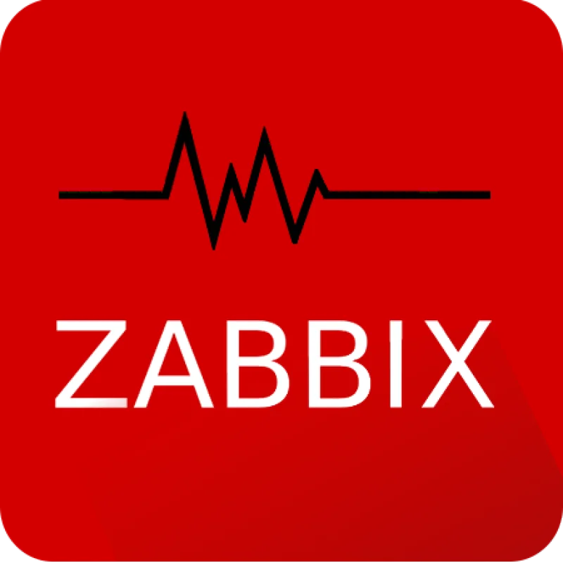

**With a focus on both development and operations, I’m passionate about building robust infrastructures and deploying secure, scalable applications.**

- 🔭 **Currently improving my DevOps skills** at Campus Numérique in the Alps, focusing on best practices.

- 🌱 **I've learned DevOps practices** such as infrastructure automation, cloud deployment (Azure, KVM), and containerization with Docker.

- 👯 **Eager to collaborate on** projects involving automation, CI/CD pipelines, and cloud infrastructure. I value teamwork and believe in the power of collective innovation to solve complex challenges.

**Motivated, detail-oriented, and committed to ongoing learning**, I thrive in environments where I can optimize systems, automate infrastructure, and develop high-quality solutions. My goal is to contribute to impactful projects and drive technological advancement.

**Let’s connect and innovate together!**

---

  

---

 

---

## Some tools and languages I have learned and used

### Development & Languages

#### Languages

          
          
          
          
          
          

                
          

#### Frameworks
          
          

---

### Systems & Tools

#### Systems
          
          

#### Software
                
          

#### Platforms
  

#### Virtualization & Automation
          

          
    

---

### Others Tools

          
          

